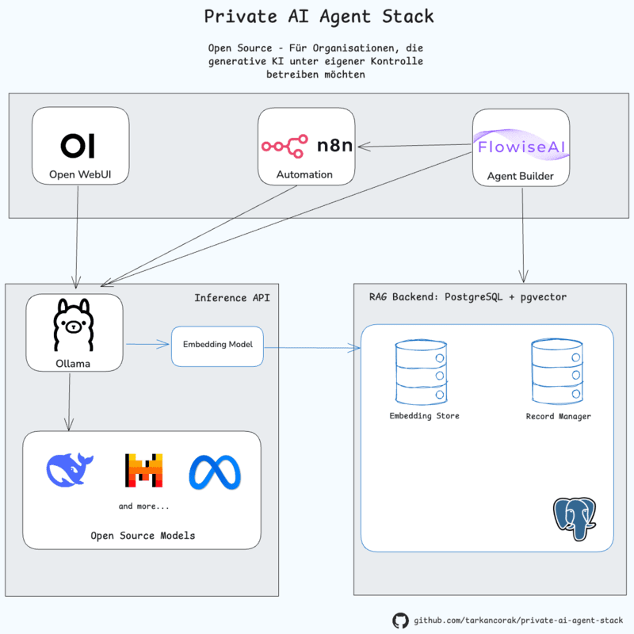

# Private AI Agent Stack

Ein modularer Stack für private, generative KI-Agentensysteme – containerisiert, lokal betreibbar und vollständig Open-Source.

Dieser Stack richtet sich an Organisationen und Entwickler:innen, die generative KI unter eigener Kontrolle einsetzen möchten – lokal, on-premise oder in einer selbstverwalteten Cloud. Der Stack bietet volle Kontrolle über Datenflüsse und schafft maximale Flexibilität durch offene Standards.

## Für wen ist dieser Stack gedacht?

### Entwickler:innen und Architekt:innen

- Bietet eine modulare, anpassbare Grundlage für die Entwicklung von KI-Agenten und -Diensten, die sich in bestehende IT-Landschaften integrieren lassen.
- Durch den Einsatz von Standard-APIs und offenen Technologien lassen sich bestehende Systeme wie Datenbanken sowie Geschäfts- und Kommunikationsplattformen einfach anbinden.

### Fachbereiche, Innovationsteams und Automatisierer:innen

- Für Teams, die KI-Agenten und Automatisierungen umsetzen möchten, bietet der Stack eine visuelle Herangehensweise – auch ohne tiefgreifende Programmierkenntnisse.
- Bestehende Systeme (z. B. CRM, ERP oder Messaging-Plattformen) können eingebunden und durch Agentenlogik gezielt erweitert werden.

### Organisationen mit Fokus auf Datenschutz und Kontrolle

- Der Stack erlaubt die Verarbeitung sensibler Daten innerhalb der eigenen privaten Infrastruktur.
- Die vollständige Kontrolle über Modelle und Daten erhöht die Sicherheit und minimiert externe Abhängigkeiten.

## Enthaltene Komponenten

- **Ollama**: Inference-Server für Open-Source-LLMs (z. B. `Llama`, `Mistral`, `DeepSeek`) mit HTTP-API für Textgenerierung, Embedding und Modellverwaltung.
- **PostgreSQL** mit `pgvector`: Datenbank mit Vektorunterstützung für RAG (Retrieval-Augmented Generation) und als persistenter Vektorspeicher für Agenten mit semantischem Langzeitgedächtnis.
- **Open WebUI**: Intuitive Weboberfläche zur direkten, privaten Interaktion mit LLMs – ähnlich wie ChatGPT.
- **Flowise**: Visuelle Low-Code-Umgebung zum Aufbau und zur Konfiguration von KI-Agenten.
- **n8n**: Workflow-Automatisierungstool für die Orchestrierung von Agenten, Diensten und Systemintegrationen.

Die folgende Grafik veranschaulicht grob das Zusammenspiel der Komponenten im Stack:



## Voraussetzungen

- [Docker Desktop](https://www.docker.com/products/docker-desktop/) muss installiert sein.

## Installation

1. **Repository klonen**

```bash
git clone https://github.com/tarkancorak/private-ai-agent-stack.git
cd private-ai-agent-stack
```

2.&nbsp;&nbsp;Docker-Netzwerk erstellen (nur einmal notwendig)

```bash
docker network create ai-network
```

3.&nbsp;&nbsp;Alle Dienste starten

```bash
# macOS / Linux
./start.sh

# Windows
start.bat
```

Alternativ startest du nur die für dich relevanten Dienste:

```bash
docker compose -f ollama/docker-compose.yaml up -d
docker compose -f openwebui/docker-compose.yaml up -d
docker compose -f postgres/docker-compose.yaml up -d
docker compose -f flowise/docker-compose.yaml up -d
docker compose -f n8n/docker-compose.yaml up -d
```

ℹ️ Open WebUI benötigt Ollama für die Ausführung von Modellen.

4.&nbsp;&nbsp;Status prüfen

```bash
# macOS / Linux
./status.sh

# Windows
status.bat
```

5.&nbsp;&nbsp;Dienste aufrufen

| Dienst         | Adresse                  | Hinweise                                                                                                                                                                                          |
| -------------- | ------------------------ | ------------------------------------------------------------------------------------------------------------------------------------------------------------------------------------------------- |
| **Open WebUI** | <http://localhost:8080>  | Beim ersten Start kann die Initialisierung einige Minuten dauern. Seite ggf. mehrfach neu laden. Modelle können direkt über die Oberfläche ausgewählt oder bei Bedarf manuell hinzugefügt werden. |
| **Flowise**    | <http://localhost:3000>  | Die Zugangsdaten (`FLOWISE_USERNAME`, `FLOWISE_PASSWORD`) sind in der Datei `flowise/docker-compose.yaml` konfiguriert.                                                                           |
| **n8n**        | <http://localhost:5678>  | Beim ersten Aufruf wird ein Benutzerkonto erstellt. Ein Lizenzschlüssel kann optional hinterlegt werden.                                                                                          |
| **Ollama API** | <http://localhost:11434> | Zentrale `Inference-API`. `Flowise` und `n8n` nutzen sie zur Kommunikation mit den Modellen, während `Open WebUI` eine interaktive Chat-Oberfläche bereitstellt.                                  |

---

6.&nbsp;&nbsp;Modelle bereitstellen

🔍 **Modell auswählen**

Du kannst ein Modell über die Oberfläche von Open WebUI auswählen oder direkt per Kommandozeile.

Die [Modellbibliothek von Ollama](https://ollama.com/library) bietet eine aktuelle Übersicht verfügbarer Modelle mit Beschreibung, Lizenz und Modellgröße – achte insbesondere auf Unterschiede bei Ressourcenverbrauch und Lizenzbedingungen.

🔧 Option 1: Modell über Open WebUI laden

- Öffne die [Einstellungen in Open WebUI](http://localhost:8080/admin/settings)
- Modellname eingeben oder aus der Liste wählen
- Mit einem Klick herunterladen

💻 Option 2: Modell über Kommandozeile laden

1.&nbsp;&nbsp;Container-ID von Ollama ermitteln:

```bash
docker ps
```

2.&nbsp;&nbsp;Shell im Container öffnen:

```bash
docker exec -it <container-id> bash
```

3.&nbsp;&nbsp;Modell laden (z. B. mistral):

```bash
ollama pull mistral
```

## Weiterführende Links

- PostgreSQL: <https://www.postgresql.org/>
- pgvector: <https://github.com/pgvector/pgvector>
- Ollama: <https://ollama.com/>
- Open WebUI: <https://github.com/open-webui/open-webui>
- Flowise: <https://flowiseai.com/>
- n8n: <https://n8n.io/>

## Dienste stoppen und neustarten

```bash
# macOS / Linux
./stop.sh    # Stoppt alle laufenden Container des Stacks
./restart.sh # Startet alle Container des Stacks neu

# Windows
stop.bat     # Stoppt alle laufenden Container des Stacks
restart.bat  # Startet alle Container des Stacks neu
```

## ⚠️ **Hinweise zur Sicherheit**

### Lizenzierung und Modellverwendung

Viele Open-Source-Modelle wie Mistral, Llama oder DeepSeek eignen sich gut für Entwicklung und Tests. Für produktive Anwendungen sollten die jeweiligen Lizenz- und Nutzungshinweise geprüft werden – insbesondere im Hinblick auf kommerzielle Nutzung.

Beachte folgende Punkte:

1. Prüfe die Lizenz des Modells und stelle sicher, dass sie mit den geplanten Einsatzszenarien übereinstimmt.
2. Achte auf die Einhaltung von AUPs (z. B. Einschränkungen für kommerzielle Nutzung).
3. Stelle sicher, dass der Einsatz den geltenden Gesetzen und Vorschriften entspricht (z. B. DSGVO, Urheberrecht, EU AI Act).

Dieser Hinweis dient der Information und stellt keine rechtliche Beratung dar.

### **Produktiver Einsatz**

Dieser Stack ist für die lokale Entwicklung und das schnelle Prototyping optimiert. Sicherheitsaspekte und Zugriffsrechte wurden bewusst vereinfacht, um den Einstieg zu erleichtern. Für den Einsatz in Produktionsumgebungen sind entsprechende Anpassungen hinsichtlich Sicherheit und Skalierbarkeit erforderlich.

Ollama eignet sich hervorragend für den lokalen Einsatz und schnelle Entwicklungszyklen. Für erweiterte Anforderungen lässt sich Ollama bei Bedarf um Funktionen wie Modellmanagement, Logging, Monitoring, Zugriffsschutz und Deployment-Automatisierung erweitern – z. B. mithilfe von [KubeAI](https://www.kubeai.org/how-to/configure-text-generation-models/), einer Open-Source-Erweiterung, die speziell für den Betrieb von LLMs in Kubernetes-Umgebungen entwickelt wurde.

ℹ️ Für den produktiven Einsatz wird empfohlen, zusätzliche Sicherheitsvorkehrungen zu treffen und die Umgebung gemäß Best Practices hinsichtlich Skalierbarkeit und Ausfallsicherheit zu konfigurieren.

## Warum dieser Stack?

Der Stack ist flexibel, skalierbar und lässt sich schnell an neue Anforderungen anpassen. Die Kombination aus Low-Code-Plattform und vollständig Open-Source-basierter Architektur macht den Stack vielseitig einsetzbar und zukunftssicher:

- Schnell einsetzbar – ideal für interne Tests, Proof-of-Concepts und erste agentenbasierte Workflows.
- Modular & portabel – alle Komponenten laufen containerisiert und können einzeln skaliert werden.
- Datensouveränität - alle Komponenten können vollständig unter eigener Kontrolle betrieben werden, ohne Abhängigkeit von externen Anbietern.
- Für gemischte Teams - vereint visuelle Entwicklung (Low-Code) mit API-basierten Integrationen für Entwickler:innen.
